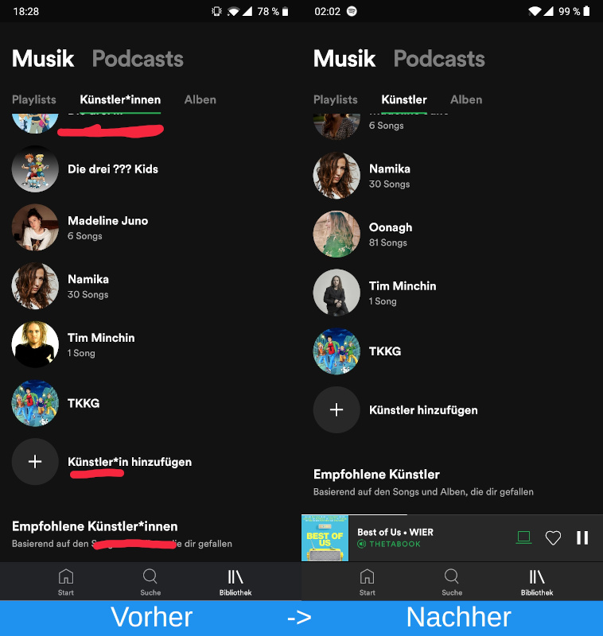
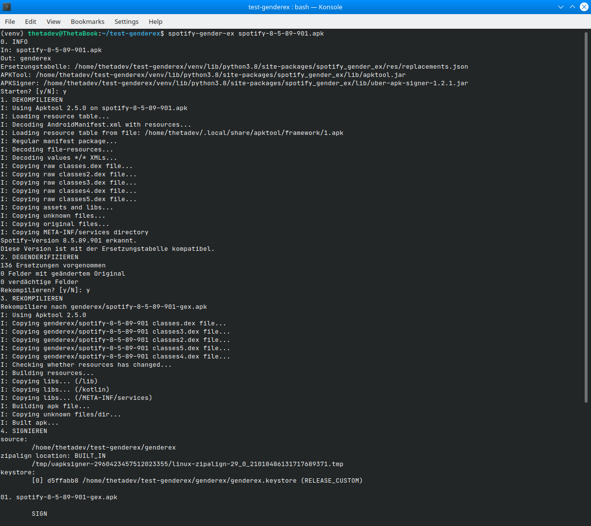
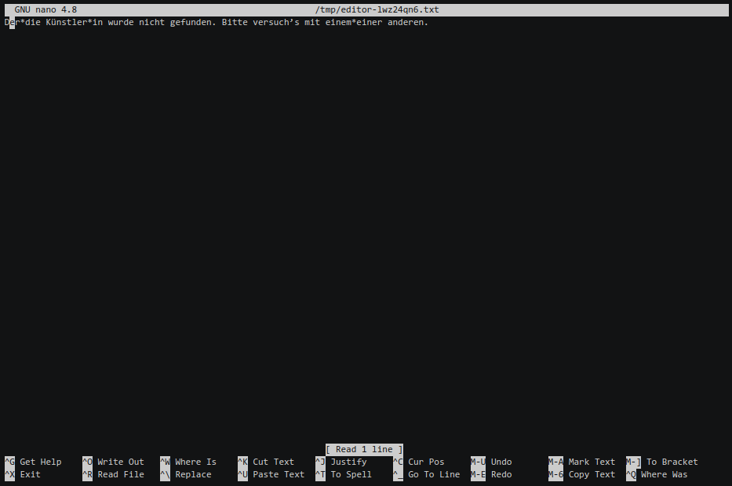

# Spotify-Gender-Ex
Ein kleines Tool, das die Gendersternchen (z.B. Künstler*innen) aus der Spotify-App für Android entfernt.



### Funktionsprinzip
Es ist möglich, mit einem Programm namens apktool Android-Apps zu dekompilieren. An den Quellcode kommt man
so nicht ohne weiteres heran, da dieser zu Java-Bytecode kompiliert wurde. Sämtliche Assets
(Bilder und eben auch Sprachdateien) lassen sich dagegen problemlos extrahieren.

Der Clou ist, dass apktool dekompilierte Apps auch wieder in eine APK-Datei packen kann. Somit sind Modifikationen
an Bildern oder Sprachdateien ohne Probleme möglich. Man kann also die Original Spotify-App dekompilieren,
die Sprachdatei öffnen (sie befindet sich unter `res/values-de/strings.xml` bzw `plurals.xml`) und diese
äußerst kreative Sprachkonstruktion:

```xml
<string name="marquee_optout_menu_disclosure_text">Das ist ein neues Musikupdate zu einem/einer Künstler*in, den/die du hörst oder dem/der du folgst. Es wird von einem unserer Musikpartnern gesponsert.</string>
```

ein wenig vernünftiger formulieren:
```xml
<string name="marquee_optout_menu_disclosure_text">Das ist ein neues Musikupdate zu einem Künstler, den du hörst oder dem du folgst. Es wird von einem unserer Musikpartner gesponsert.</string>
```

Versucht man die so modifizierte und rekompilierte Spotify-App zu installieren, wird die Installation mit einer
nichtssagenden Fehlermeldung (App wurde nicht installiert o.ä.) abbrechen. Der Grund hierfür ist, dass Android-Apps
vom Entwickler signiert werden müssen, um ihre Authentizität zu gewährleisten.

Die modifizierte App hat noch keine Signatur, deswegen muss sie erst noch signiert werden (hierfür wird das
Tool Uber APK Signer verwendet). Anhand der Signatur kann Android auch feststellen, ob eine bereits installierte
App mit der entsprechenden APK-Datei aktualisiert werden kann. Da die veränderte Spotify-App selbst signiert wird,
muss eine eventuell vorhandene Original-Spotify-App zuerst deinstalliert werden.

### Systemvoraussetzungen
Spotify-Gender-Ex ist mit Windows und Linux kompatibel (getestet mit Ubuntu 20 und Windows 10)

Python 3 und Java müssen auf deinem System installiert sein (testen mit `python3` und `java -version`).
Außerdem brauchst du natürlich auch ein Android-Smartphone oder Tablet, um die modifizierte App zu installieren.

### Wie es geht

 
1. Öffne ein Terminal in einem leeren Ordner und erstelle eine neue Python-Umgebung mit dem Befehl `python -m venv venv`.
Aktiviere sie mit `source venv/bin/activate` bzw auf Windows mit `venv\Scripts\activate`.
   
2. Installiere Spotify-Gender-Ex mit diesem Befehl:
    ```shell
    pip3 install spotify-gender-ex
    ```

3. Starte das Skript mit dem Befehl `spotify-gender-ex`

5.  Bestätige mit Enter. Nun wird die apk-Datei dekompiliert, es werden die Ersetzungen vorgenommen
    und anschließend wird eine neue, signierte apk-Datei erzeugt.
   
6.  Wenn du eine neue Spotify-Version verwendest, kann es sein, dass neue Einträge zur Sprachdatei
    und damit auch neue Gendersternchen hinzukommen. Diese werden als 'verdächtig' erkannt.
    GenderEx öffnet dann einen Texteditor mit dem Inhalt des verdächtigen Felds.
    
    

    Nun kannst du das Feld manuell bearbeiten. Wenn du alle Gendersternchen entfernt hast, kannst
    du die Datei speichern und das Skript fährt automatisch fort. Sämtliche Ersetzungsregeln, die du
    auf diese Art selbst erstellt hast, landen in der Datei `GenderEx/replacements.json` und werden
    auch bei zukünftiger Verwendung des Skripts berücksichtigt.

7.  Wenn alles geklappt hat, befindet sich nach Abschluss des Skripts eine veränderte und signierte Spotify-App
    unter `genderex/spotify-x-x-xx-xxx-gex-aligned-signed.apk`. Diese Datei kannst du nun auf dein Handy/Tablet
    übertragen und installieren. Hierfür einfach die APK-Datei im Dateimanager öffnen und eventuell noch die
    Installation aus unbekannten Quellen erlauben.
    
    Vorher muss die Original-Spotify-App deinstalliert werden, da eine App mit anderer Signatur nicht
    als Update installiert werden kann.
    
    Es kann passieren, dass Play Protect aufgrund der unbekannten Signatur eine Meldung ausgibt, in diesem
    Fall einfach auf "Trotzdem installieren" und "Nicht an Google senden" tippen.
    
8.  Nun kannst du die Spotify-App öffnen, dich anmelden und Musik ohne Gendersternchen genießen. Du kannst
    auch ins Einstellungsmenü gehen und auf `Drittanbieter-Software` tippen. Auf der Seite befinden sich
    Informationen über dieses Skript, die zum Testen und zur Fehlersuche relevant sein können.

### Asciicasts

Wenn du das Skript in Action sehen willst, habe ich hier ein paar Asciicasts aufgenommen.

https://asciinema.org/a/392687

https://asciinema.org/a/393371

### Ersetzungstabellen
Jede Ersetzungstabelle enthält eine Liste
kompatibler Spotify-Versionen und sämtliche vorzunehmenden Ersetzungen bestehend aus
Sprachdatei, Schlüssel, Originaltext und neuem Text.

Hier ein Beispiel für eine Ersetzungsregel:
```json
{
  "key": "artist_default_title",
  "old": "Künstler*in",
  "new": "Künstler"
}
```

Bei der Ersetzung geht Spotify-Gender-Ex durch alle Sprachdateien und versucht, das entsprechende
Feld anhand des Schlüssels und des Inhalts in einer Ersetzungstabelle zu finden.
Wurde ein zu ersetzendes Feld gefunden, wird der Text durch den neuen ausgetauscht.

Spotify GenderEx arbeitet mit 2 Ersetzungstabellen: der eingebauten und der benutzerdefinierten Tabelle.
Die eingebaute Tabelle befindet sich im Package unter `spotify_gender_ex/res/replacements.json`.
Wenn möglich verwendet das Skript aber die aktuelle Version von GitHub unter
https://github.com/Theta-Dev/Spotify-Gender-Ex/blob/master/spotify_gender_ex/res/replacements.json.

Findet GenderEx nun Einträge in der Sprachdatei, die Gendersternchen aufweisen, aber nicht von der eingebauten
Ersetzungstabelle abgedeckt sind, kannst du deine eigene Ersetzungsregel eintippen. Diese Einträge werden
in der benutzerdefinierten Ersetzungstabelle gespeichert, die sich unter `GenderEx/replacements.json` befindet.

Möchtest du eine eigene Ersetzungstabelle anstatt dieser beiden Tabellen verwenden, so kannst du diese mit
der Option `-rt` angeben.

### FAQ
#### Betrug! Da sind immer noch Gendersternchen in der App!
Die Spotify-App besteht nicht nur aus vorprogrammierten Interfaces, sondern auch aus dynamischen
Inhalten, die tagesaktuell von Spotify heruntergeladen werden (im Grunde nichts anderes als an
die Spotify-App angepasste Websites). Dies ist bei der Startseite sowie bei Künstler-Seiten der Fall.
Da diese Texte direkt von den Spotify-Servern und nicht aus der Sprachdatei der App stammen, lassen sie sich
auch nicht durch Modifikation der App verändern.

#### Die Installation der modifizierten App funktioniert nicht

- Stelle sicher, dass du die App-Installation von unbekannten Quellen aktiviert hast
- Verwende die signierte Version (`spotify-x-x-xx-xxx-gex-aligned-signed.apk`)
- Stelle sicher, dass du nicht die originale oder eine mit einen anderen als dem im Verzeichnis
`genderex/genderex.keystore` befindlichen Keystore signierte Spotify-App installiert hast.
  
#### Ich liebe Gendersternchen/nutze kein Spotify. Ist dieses Skript auch für was anderes nützlich?
Ja, man könnte dieses Skript bspw. auch dafür benutzen, um Spotify (bzw. mit Änderungen jede andere Android-App)
in eine andere Sprache zu übersetzen, wenn die Originalübersetzung nicht vorhanden oder von mangelhafter Qualität ist.

<!-- TODO:
#### Ich will NOCH MEHR Automatisierung. Ich will Spotify wie zu guten alten Zeiten ohne Gendersternchen direkt von meinem Handy runterladen und installieren, ohne bei jeder neuen Spotify-Version ein Skript benutzen und die App manuell auf mein Gerät übertragen zu müssen.
Ich habe GenderEx zusammen mit Pythons SimpleHttpServer in einen Docker-Container gepackt.-->

### Lizenzen und Rechtliches
Dieses Projekt enthält die Java-Pakete [apktool](https://bitbucket.org/iBotPeaches/apktool/src/master/) (iBotPeaches)
und [Uber APK Signer](https://github.com/patrickfav/uber-apk-signer) (patrickfav), die beide unter der
Apache 2.0 License stehen.
Vielen Dank für diese großartigen Open-Source-Projekte!
Die Lizenzen befinden sich im `spotify_gender_ex/lib`-Ordner.

Es ist mir aus Copyrightgründen nicht erlaubt, degenderifizierte Kopien der Spotify-App zum
Download anzubieten. Wenn du dieses Tool herunterlädst und deine Spotify-App selbst modifizierst, 
gehst du sämtliche damit verbundene Risiken ein. Sollte die App nicht wie gewünscht funktionieren,
empfehle ich, zuerst die Originalversion zu testen, bevor du dich an den Spotify-Support wendest.
