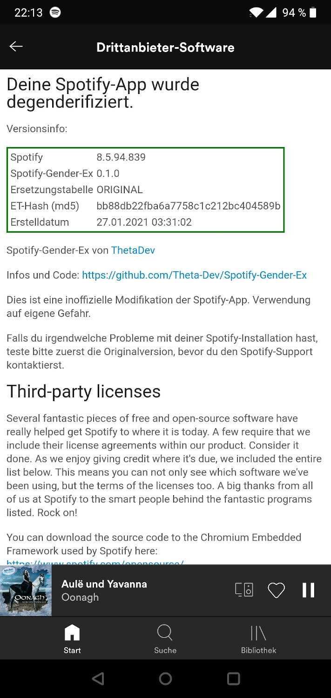

# Ersetzungstabellen

## GenderEx 0.x.x

Hier ist der MD5-Hash der Ersetzungstabelle für jede Gender-Ex-Version.

| Version | letzte Spotify-Version | Hash                             |
| ------- | ---------------------- | -------------------------------- |
| 0.1.x   | 8.5.94.839             | a67c36a7e575b3a75fbb75e0a1b5b6cd |
| 0.2.x   | 8.5.98.984             | 15b048084ceda494fb9f80c8fd38529d |
| 0.3.x   | 8.6.2.774              | 8ca73f670adca762bf5d1b63c36ecd34 |

Der Hash wird zusammen mit Versionsinformationen in jede modifizierte App geschrieben und ist unter
**Einstellungen > Drittanbieter-Software** abrufbar.

Da modifizierte Apps, wenn sie einmal installiert sind, nicht ohne weiteres im Fehlerfall zu analysieren sind, habe ich
diese Funktion hinzugefügt.

Wenn du ein Problem mit Spotify-Gender-Ex hast, kannst du diese Informationen in deinen Fehlerbericht einfügen. Anhand
der Versionsinformationen und des Hashes kann ich dann ermitteln, welche Ersetzungstabelle verwendet wurde und
möglicherweise fehlerhaft ist.

## GenderEx 1.x.x

| Version | letzte Spotify-Version |
| ------- | ---------------------- |
| 3       | 8.6.2.774              |

GenderEx 1.x.x arbeitet mit 2 Ersetzungstabellen: der eingebauten und der benutzerdefinierten Tabelle. Die eingebaute
Tabelle befindet sich im Package unter `spotify_gender_ex/res/replacements.json`. Wenn möglich verwendet das Skript aber
die aktuelle Version von GitHub.

Findet GenderEx nun Einträge in der Sprachdatei, die Gendersternchen aufweisen, aber nicht von der eingebauten
Ersetzungstabelle abgedeckt sind, kannst du deine eigene Ersetzungsregel eintippen. Diese Einträge werden in der
benutzerdefinierten Ersetzungstabelle gespeichert, die sich unter `GenderEx/replacements.json` befindet.

Möchtest du eine eigene Ersetzungstabelle anstatt dieser beiden Tabellen verwenden, so kannst du diese mit der
Option `-rt` angeben.

Alle Ersetzungstabellen haben eine Versionsnummer, die bei jedem Update inkrementiert wird. Bei der benutzerdefinierten
Tabelle übernimmt GenderEx das automatisch, immer wenn neue Ersetzungsregeln in das Skript eingegeben werden.

Aus sämtlichen verwendeten Ersetzungstabellen baut GenderEx einen Versionsstring, der an den Namen jeder erzeugten
APK-Datei angehängt wird und auch in der fertigen Spotify-App unter
**Einstellungen > Drittanbieter-Software** zu sehen ist. Dabei erhalten die Ersetzungstabellen folgende Kennbuchstaben:

`b`: builtin (eingebaut), `c`: custom (benutzerdefiniert), `s`: specified

Beispiele für Versionsstrings:

`b3`: Nur die eingebaute Ersetzungstabelle mit Version 3 
`b3c1`: Eingebaute Ersetzungstabelle: Version 3, benutzerdefinierte Ersetzungstabelle: Version 1
`s2`: Es wurde eine Ersetzungstabelle mit Version 2 spezifiziert

Die Versionsangaben erleichtern die Zuordnung mehrerer erzeugter Dateien sowie die Fehlersuche.

## GenderEx 3.x.x

Den ersten Teil der Versionsstrings habe ich aus GenderEx 2 übernommen. Allerdings hat die integrierte Ersetzungstabelle
nun das Präfix ``i`` und mit ``-rt`` zusätzlich manuell hinzugefügte Tabellen erhalten das Präfix ``a``.

Nach dem Teil mit der Ersetzungstabelle kommt die Information über die neu hinzugefügten Ersetzungsregeln. Bemerkt das
Programm während dem Ersetzen verdächtige Einträge, für die es keine Ersetzungsregeln gibt, wird der Nutzer darum
gebeten, sie zu korrigieren. Diese neuen Ersetzungsregeln werden in einer eigenen Ersetzungstabelle im
Ordner ``output/repl`` gespeichert. Die Anzahl dieser neuen Regeln wird mit dem Buchstaben N an den Dateinamen angefügt.
Der Buchstabe S (suspicious) markiert die Anzahl an neuen Ersetzungsregeln, die immer noch Gendersternchen enthalten.
Dies ist immer dann der Fall, wenn GenderEx im ``--noia``-Modus betrieben wird (zum Beispiel ein einer Automatisierung).

| Typ                         | Dateiname                                         |
| --------------------------- | ------------------------------------------------- |
| builtin                     | spotify_8_6_44_851_genderex_i12.apk               |
| builtin + new items         | spotify_8_6_44_851_genderex_i12_3N.apk            |
| builtin + suspicious items  | spotify_8_6_44_851_genderex_i12_1N2S.apk          |
| custom                      | spotify_8_6_44_851_genderex_c1.apk                |

### Informationen in der App

| Name                        | Wert                             |
| --------------------------- | -------------------------------- |
| Spotify                     | 8.6.44.851                       |
| Spotify-Gender-Ex           | 3.0.0                            |
| Ersetzungstabellen          | i12 (8ca73f67), a1(15b04808)     |
| Neue Ersetzungsregeln       | 3N                               |
| Erstelldatum                | 16.07.2021 20:51                 |
